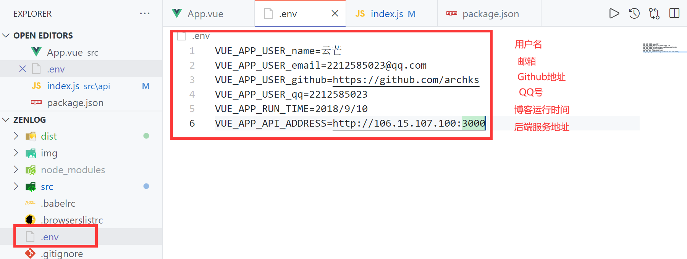
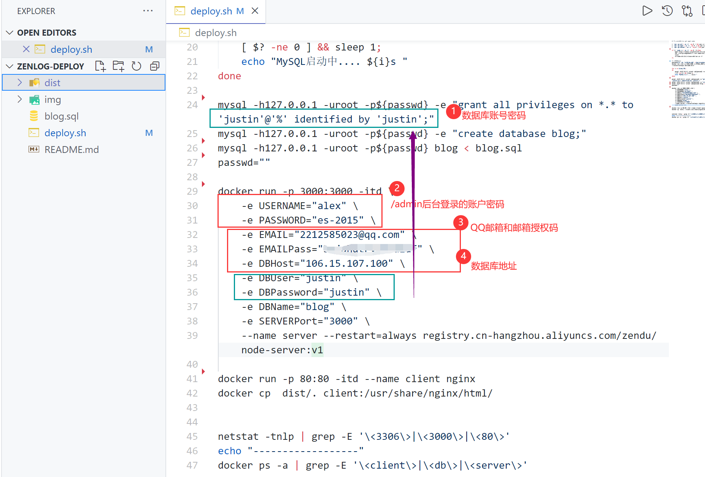
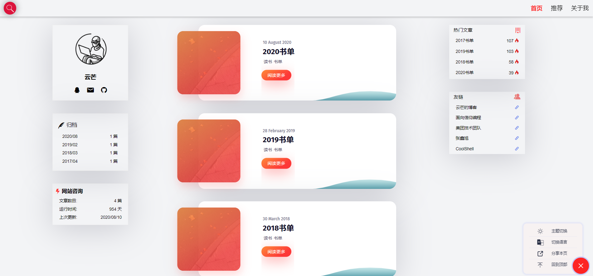
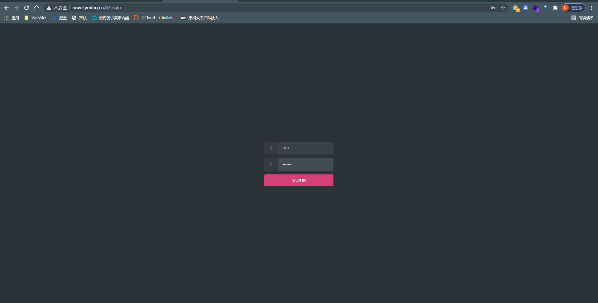
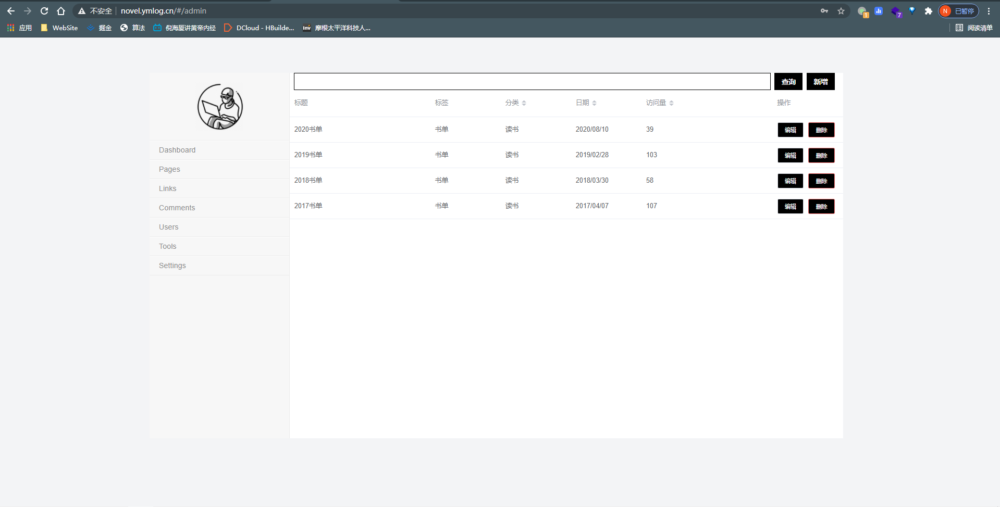
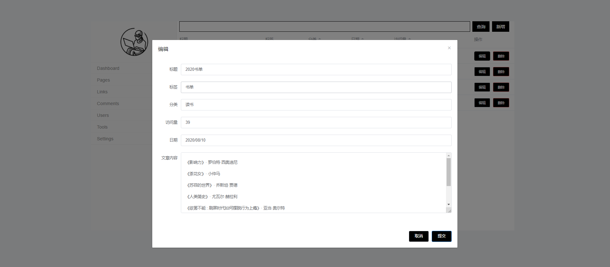

> 博客网站一键部署脚本

> 客户端 https://github.com/ArchKS/zenlog

> 服务端 https://github.com/ArchKS/zenlog-server

> 部署 https://github.com/ArchKS/zenlog-deploy

> 演示 https://www.bilibili.com/video/BV1zK4y1d7er/

## 自定义部署 [ 必看 ]

步骤

1. 前端环境变量文件，修改后重新build，将新的dist目录替换zenlog-deploy下的dist目录，如图一
2. 部署信息，修改deploy.sh，主要是后端服务的数据库信息以及用户邮箱等，如图二
3. 在Linux/CentOS7 环境下执行 `sh deploy.sh`， 具体操作见B站演示视频

[ 图一 ]

[ 图二 ]

---

## 博客示意图

文章展示 http://novel.ymlog.cn/#/home

登陆界面 http://novel.ymlog.cn/#/login

后台管理 http://novel.ymlog.cn/#/admin

