**Begin FROM 2021/3/7**

**Author ZENDU**

**DESC 'Personal Blog Project'**


## 2021/3/7 

1. 完成数据库建表、录入数据

2. 完成前端、后端、数据库的设计、规划

 

## 2021/3/8

1. 批量录入测试数据，将markdown文件存储到数据库中

2. 编写API接口，实现文章列表、指定文章的查询

3. 编写前端内容

   a)   建构前端框架

   b)   引入element-ui

   c)   引入iconfont

   d)   引入global.scss

   e)   完成部分navgation导航栏操作，封装jumpto方法实现导航栏路由跳转

   f)   实现导航栏logo渐变色

 


<p align="middle" style="margin: 10px auto;">
    
</p>
 

 

## 2021/3/13

1. 设计页面背景：

> https://vue-particles.netlify.app/

> https://www.vantajs.com/

2. 重写nav导航栏的结构，将item写入data中

3. 删除TOOL、ME、OTHER等无关导航路由

4. 编写首页分栏，分为用户信息页和内容展示页面

5. 编写用户信息展示页面，将用户名、邮箱地址、QQ、Github地址抽象到ENV中，并完成用户信息侧边栏的编写

6. 解决了element导航栏默认只加载第一个，刷新页面后路由和标签不匹配的BUG

<p align="middle" style="margin: 10px auto;">
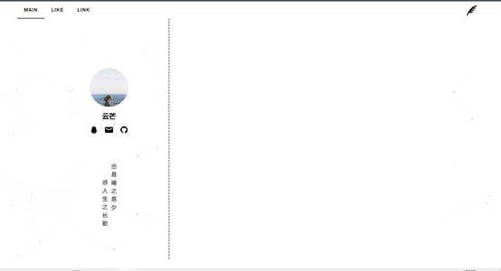
</p>


 <p align="middle" style="margin: 10px auto;">
    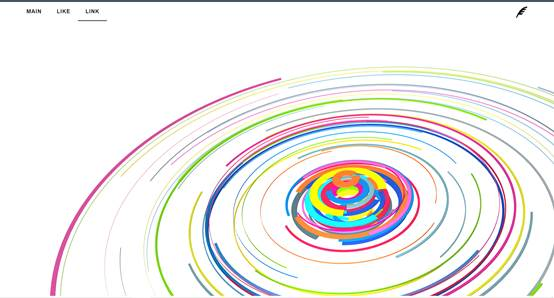
</p>


## 2021/4/5

1. 删除particles.js vanta.js等特效

2. 删除ElementUI组件库

3. 启用tailwind.css

4. 重写导航栏nav

5. 删除link，准备添加到网站主页右侧

6. 重写personinfo

7. 重写timeline用于展示每个月发表的文章数目

8. 增加暗黑模式


<p align="middle" style="margin: 10px auto;">
    
</p>


 <p align="middle" style="margin: 10px auto;">
    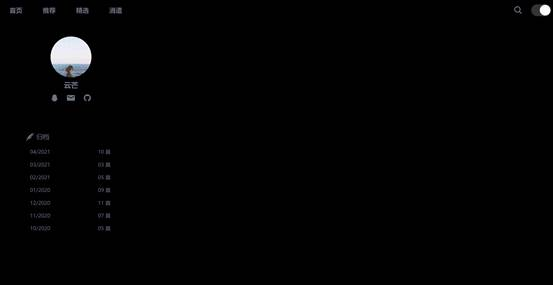
</p>


9. 完成顶部搜索框以及交互动画的编写

 <p align="middle" style="margin: 10px auto;">
    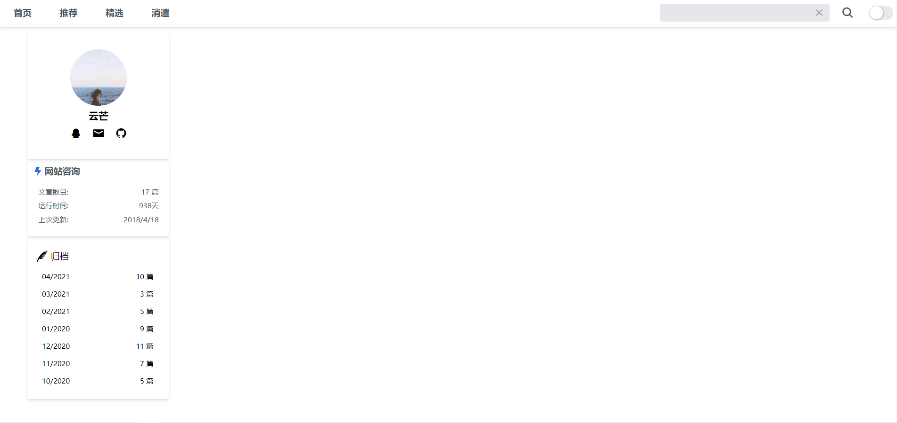
</p>


<p align="middle" style="margin: 10px auto;">
    
</p>


10. Fix BUG Visual Studio Code CSS linting with Tailwind

> https://www.meidev.co/blog/visual-studio-code-css-linting-with-tailwind/


## 2021/4/12

- 页面重新设计
- 文章排版
- 热门推荐
- 友情链接
- 暗黑模式优化
- 造数据库假数据
- 测试后端接口
- 渲染Markdown：https://www.cnblogs.com/youxam/p/vue-markdown-render.html
- 编写markdown样式 markdown.scss
- 优化网站咨询、优化归档、优化API接口数据结构

待解决：

- 利用timeline过滤文章 √ END 2021/4/14
- 利用search过滤文章 √ END 2021/4/14
- 推荐页面 √ END 2021/4/14
- 精选页面
- 消遣页面
- 文章访问次数统计 √ END 2021/4/14

<p align="middle" style="margin: 10px auto;">
    
</p>


<p align="middle" style="margin: 10px auto;">
    
</p>


<p align="middle" style="margin: 10px auto;">
    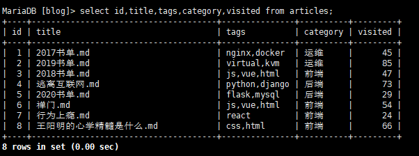
</p>


<p align="middle" style="margin: 10px auto;">
    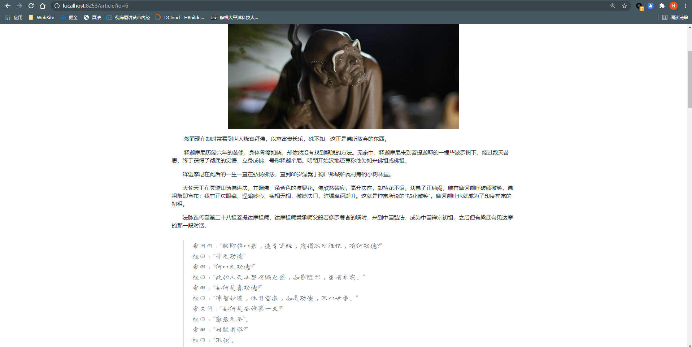
</p>


## 2021/4/13

- 完善filterbar的过滤，包含过滤timeline、searchContent、tags、category
- 添加一键清除按钮
- 调整filterbar的样式
- 修改timeline选中操作
- 访问文章更新visited
- 添加nav动画效果
- 修改articleItem在首页  和 进入markdown页面退出后 title渲染位置不一致的BUG
- 修复filterBar在首页 和 进入markdown页面退出后，filterbar不一致的问题
- 完成文章搜索功能的后端接口
- 完成搜索结果hover展示


<p align="middle" style="margin: 10px auto;">
    
</p>


<p align="middle" style="margin: 10px auto;">
    
</p>


- FIX BUG：数据库自动更新

<p align="middle" style="margin: 10px auto;">
    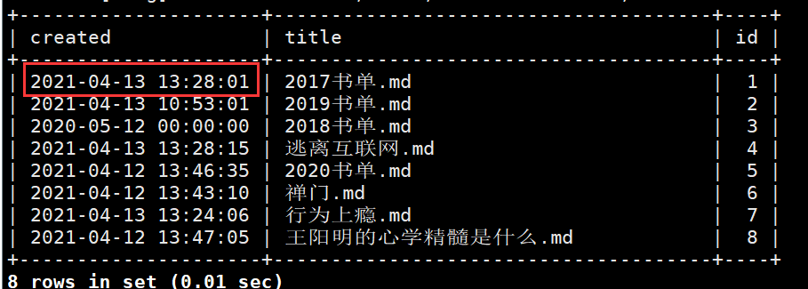
</p>


```sql
update articles set visited=visited+1,created=created where id = ${id};
```

<p align="middle" style="margin: 20px auto;">
    
</p>


## 2021/4/14

- 重写滚动事件，重写鼠标滚动事件，搜索结果支持水平滚动
- 重写footer组件，添加动态波浪效果
- 重写背景和nav的颜色，包括暗黑模式
- 修复搜索功能第一次searchResult不显示的BUG
- 微调用户信息展示界面的样式
- 完善知乎热榜的链接功能，用cheerio+re的方式解析出链接
- 添加微博热榜、36Kr
- 完善热榜动画效果，采用卡片动画实现

- 重写Article_Item，将搜索结果展示到左侧image-wrapper，取消鼠标滚动


<p align="middle" style="margin: 10px auto;">
    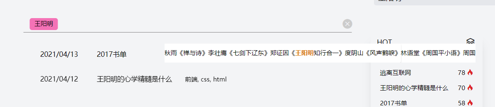
</p>


<p align="middle" style="margin: 10px auto;">
    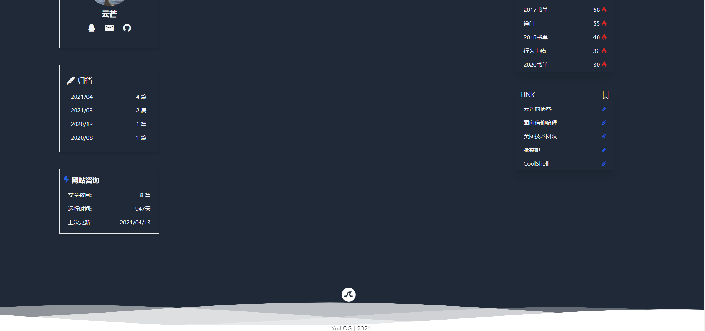
</p>


<p align="middle" style="margin: 10px auto;">
    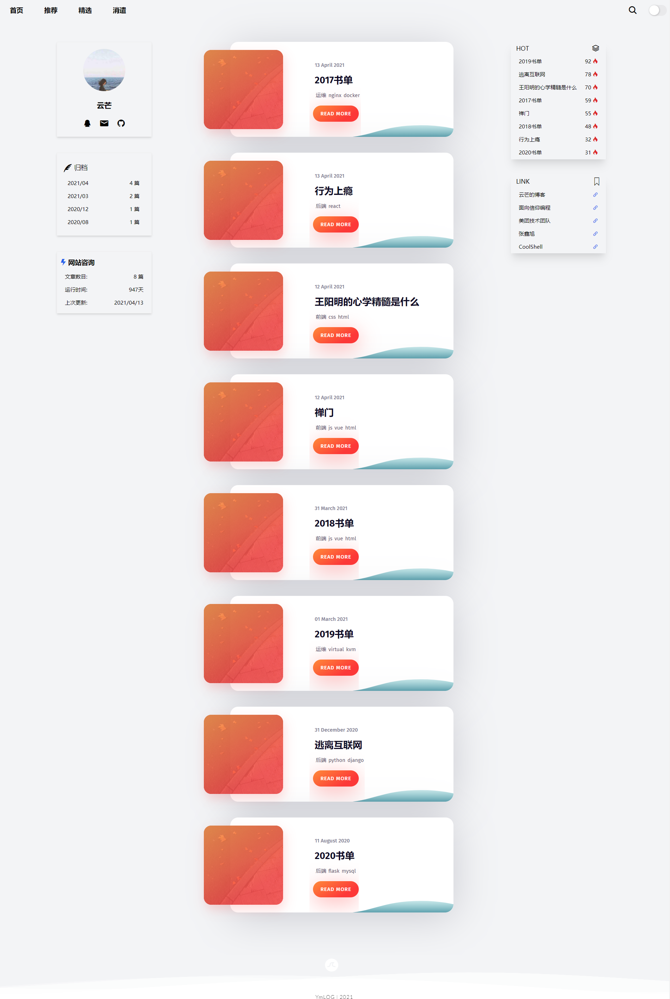
</p>


<p align="middle" style="margin: 10px auto;">
    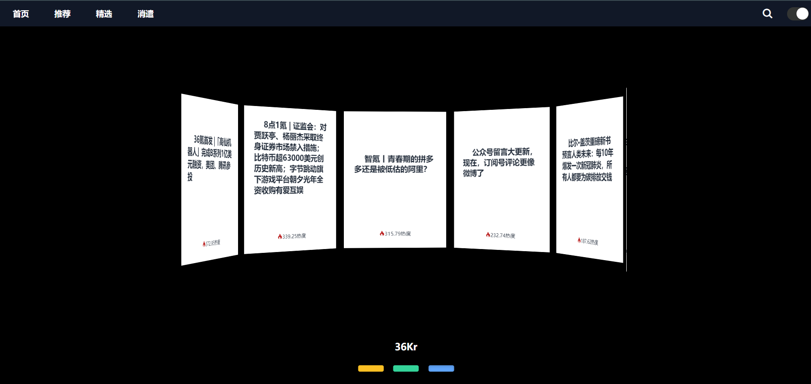
</p>


后续待实现：

- 推荐页面保持热榜标题显示，目前是hover之后显示
- 首页文章目录分页功能待实现
- 导航菜单的选中样式有待添加


## 2021/4/15

- 重写导航栏，导航栏条目采用组件引入而非路由
- 调整filterbar的位置，让他在导航栏中间
- 完成导航栏选中样式
- 优化首页布局，将导航栏 | （首页、推荐页、个人信息页面）放在一起； 如果用router-view渲染，则导航栏不能实现阴影效果；放置在一张页面，实现了更加合理的纵向布局，不需要指定margin-top即可正常显示
- 鼠标下滑 && 如果当前没有过滤字段，导航栏隐藏；否则，导航栏显示
- 优化Recommand Page中platform的显示状态
- Vue分页，将请求到的列表 以pageIndex划分为一个二位数组，数组最后一项填充item，使之满足  articles.length % pageIndex === 0，这样做是为了让分页组件始终固定在指定位置，不会因为某一个页面有3篇文章，下一页有2篇文章的时候，发生抖动坍塌。
- 根据暗黑模式，修改svglogo颜色
- 优化导航栏触发方式，当clientY鼠标位置小于200时，也打开导航栏


<p align="middle" style="margin: 10px auto;">
    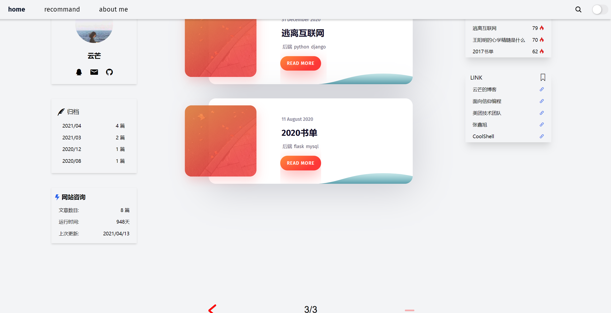
</p>


## 2021/4/16

- 添加vue-i18n国际化
- 修改主页卡片排版 
- 微调图标
- 添加Fixed菜单控件，支持主题切换、分享本页、回到顶部、语言切换
- 移动端适配
- meta优化
- 重写导航栏搜索框
- FIX 解决网络连接失败后，再次连接文章无法渲染的问题，使用watch监听articles，如果变化，则重新渲染；只监听articles会导致翻页无法渲染，所以还需要监听currentIndex，最后articlelist这个组件需要同时监听tag、category、timeline、searchResult、searchContent、articles、currentIndex多个值
- FIX 解决从"推荐"切换到"首页"时，文章列表消失的问题
- FIX wave在Mobile模式下距离顶部太近
- 初始化DarkMode为暗黑模式

<p align="middle" style="margin: 10px auto;width:100wh">
    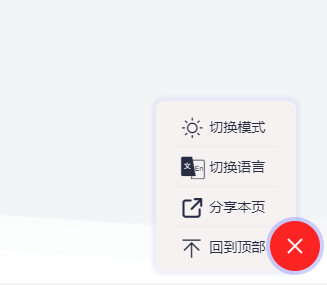
</p>


<p align="middle" style="margin: 10px auto;">
    
</p>


## 2021/4/17

- 完成"About Me"页面
- 前端客户联系界面，后端邮件模块
- 修改组件文件夹
- 整体代码调试，部署上线
- 整体国际化


<p align="middle" style="margin: 10px auto;">
    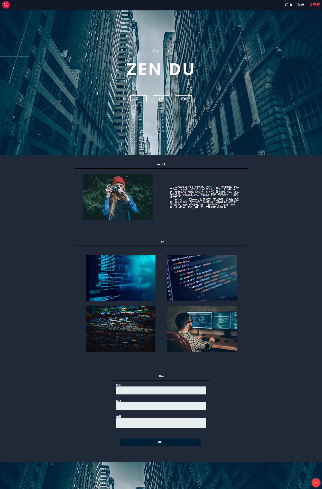
</p>


## 2021/4/18

Todo

- [x] Navigation的响应式布局
- [x] 后端登录接口 + 前端登录页面 （如果Admin管理页面没有Cookie信息，则会强制跳转到login页面）
- [ ] 登录模块和登录解决方案，前后端怎么写
- [ ] 文章列表
- [ ] 文章的新建、修改、删除


<p align="middle" style="margin: 10px auto;">
    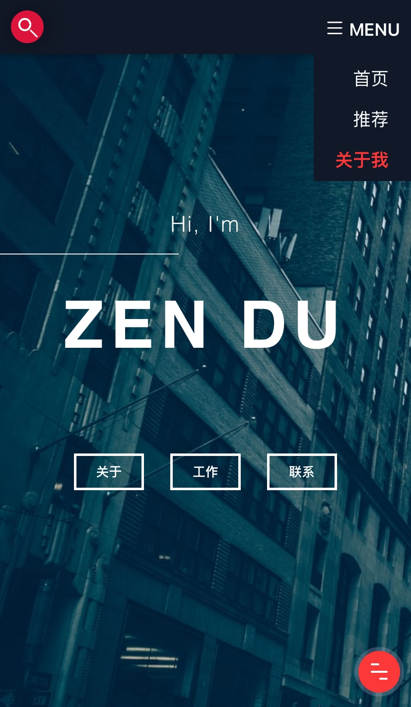
</p>


<p align="middle" style="margin: 10px auto;">
    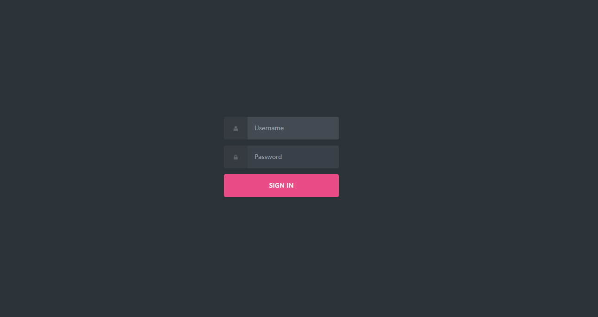
</p>


## 2021/4/19

- FIX BUG 点击nav/filter-bar会打开menu，因为menu的width=100%，采用绝对定位修改menu位置和宽度
- 移动端调整Timeline和SiteInfo的宽度间距
- 移动端调整搜索框的大小
- 开始编写DashBoard

- [ ]  编辑、删除、查询、新增等功能待实现

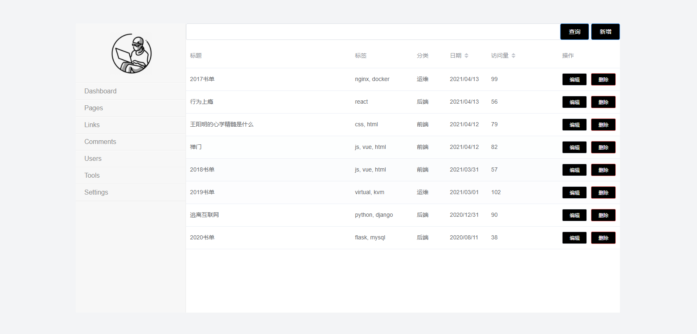


## 2021/4/20

- 完成文章更新
- 完成文章编辑
- 完成文章删除
- 完成文章新建
- 完成admin过滤功能

- 容器化部署前端和后端


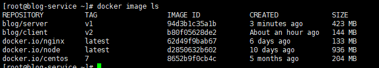


- To Do 数据库容器化


## 后端接口

```bash
# 获取所有文章
http://106.15.107.100:3000/articles

# 获取指定文章
http://106.15.107.100:3000/article?id=1

# 搜索数据库
http://106.15.107.100:3000/search?keyword=王阳明

# 获取热榜
http://106.15.107.100:3000/hot?platform=weibo
http://106.15.107.100:3000/hot?platform=zhihu
http://106.15.107.100:3000/hot?platform=kr
```


数据库站点信息

```
用户名 密码

访问记录	day1 day2 day3 ....
累计访问
上周访问
```

